<p align="center">
  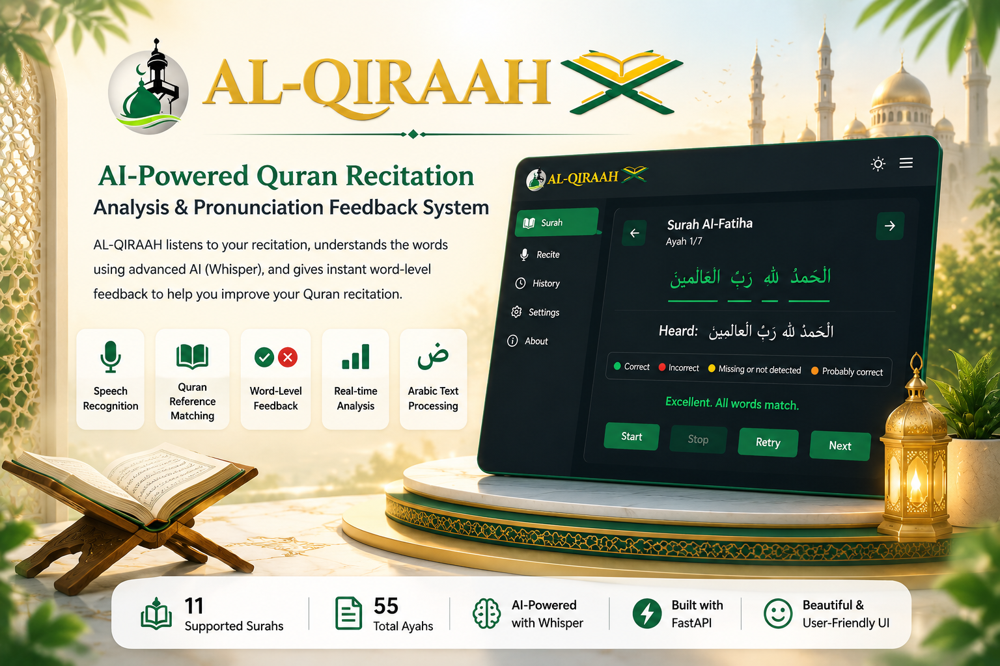
</p>

<p align="center">
  
</p>

---

<h3 align="center">
AI-Powered Quran Recitation Evaluation & Pronunciation Feedback System
</h3>

<p align="center">
Version 1.0 (Prototype Release)
<br>
11 Supported Surahs • 55 Quran Ayahs • Custom Reference Dataset
</p>

---

## Project Overview

AL-QIRAAH is an AI-powered Quran recitation evaluation system designed to assist users in improving their Quran pronunciation through intelligent word-level feedback.

The platform enables users to select a Surah, recite an Ayah using their microphone, and receive detailed pronunciation feedback by comparing their recitation against reference Quran datasets generated from Sheikh Abdul Samad's recitations.

To improve recitation analysis accuracy, the system combines Whisper AI speech recognition, Arabic text normalization, structured word templates, word alignments, and MFCC-based reference features. These components work together to evaluate pronunciation at the word level and provide meaningful feedback to the user.

Unlike conventional speech-to-text systems, AL-QIRAAH focuses specifically on Quran recitation evaluation and employs a custom-built reference dataset pipeline tailored for Arabic pronunciation analysis.

### Key Highlights

* Real-time Quran recitation evaluation
* Whisper AI powered speech recognition
* Arabic text normalization pipeline
* Word-level pronunciation analysis
* 🟢🟡🔴 Color-coded feedback system
* Custom Quran reference datasets
* Dark and Light theme support
* FastAPI-powered backend
* Modern web-based interface

> **Current Prototype Scope:** Version 1.0 supports 11 Surahs containing 55 Ayahs and demonstrates the complete AI-powered recitation evaluation pipeline, from audio capture and speech recognition to word-level pronunciation feedback.

---
## Live Demonstration

<p align="center">
  
</p>

<p align="center">
  Complete Quran Recitation Evaluation Workflow Demonstration
</p>

---

## Core Features

### AI-Powered Recitation Analysis
* Evaluate Quran recitation using Whisper AI speech recognition combined with custom pronunciation analysis techniques.

### Surah & Ayah Selection
* Browse available Surahs and select individual Ayahs for recitation practice and evaluation.

### Word-Level Pronunciation Feedback
* Analyze recitation accuracy at the word level rather than only providing sentence-level results.

### Color-Coded Evaluation System
Receive intuitive visual feedback:

- 🟢 Correctly recited words
- 🟡 Probably correct or partially matched words
- 🔴 Incorrectly recited words
- ⚪ Missing or undetected words

### Arabic Text Normalization
* Normalize Arabic text before comparison to improve matching consistency and reduce recognition noise.

### Custom Quran Reference Datasets
Built using multiple interconnected datasets:

- AUDIO_RAW
- ALIGNMENTS
- REF_NEW_WORDS
- WORD_TEMPLATES_BY_SURAH
- ABDULSAMAD_AYAH_MASTER

### Dark & Light Theme Support
* Switch seamlessly between dark and light interfaces based on user preference.

### FastAPI Backend Integration
* Backend services are powered by FastAPI for efficient audio processing and evaluation.

### Detailed Recitation Evaluation
* Provide structured feedback that helps users identify pronunciation weaknesses and improve recitation accuracy.

### Extensible Architecture
* The current prototype includes 11 Surahs and 55 Ayahs. The architecture and dataset pipeline are designed for expansion through additional Surah datasets, Ayah templates, alignments, and MFCC reference files.

---
# System Architecture

AL-QIRAAH combines speech recognition, Arabic text processing, custom Quran reference datasets, and word-level pronunciation evaluation into a unified recitation analysis pipeline.

The system accepts a user's Quran recitation through the web interface, processes the audio using Whisper AI, compares the recited words against custom Quran reference datasets generated from Sheikh Abdul Samad's recitations, and returns detailed color-coded pronunciation feedback at the word level.

---

## Overall Architecture

<p align="center">
  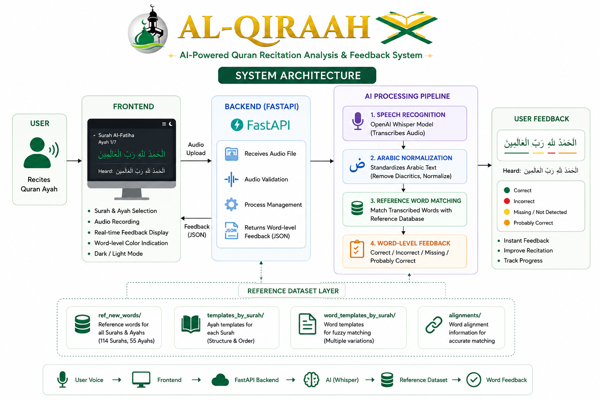
</p>

<p align="center">
  <i>High-Level Architecture of the AL-QIRAAH System</i>
</p>

---

## Recitation Evaluation Workflow

<p align="center">
  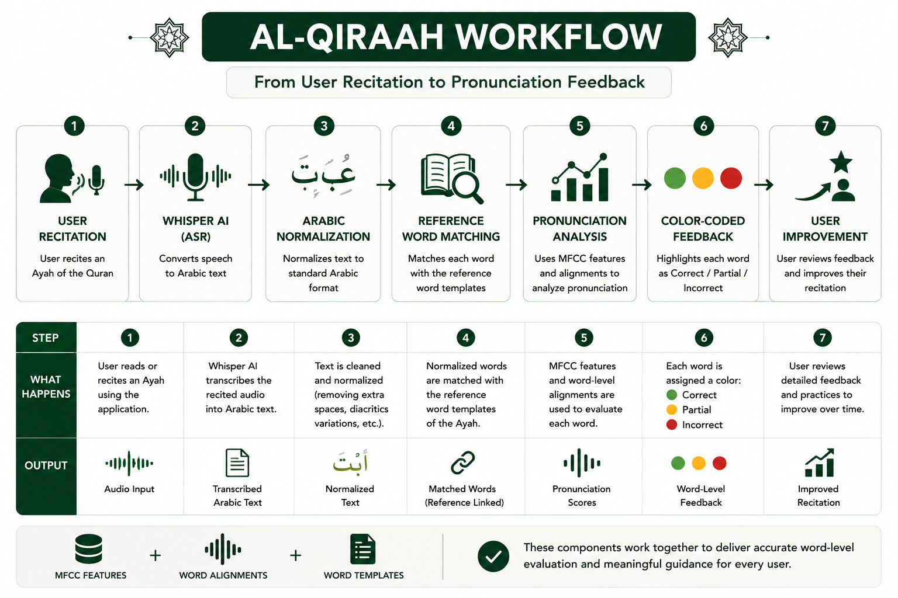
</p>

<p align="center">
  <i>End-to-End Quran Recitation Evaluation Workflow</i>
</p>

---

## Detailed Processing Pipeline

### 1. User Recitation

The user selects a Surah and Ayah from the web interface and recites the verse using a microphone.

**Input:**
- Selected Surah
- Selected Ayah
- User voice recording

---

### 2. Speech Recognition (Whisper AI)

The recorded audio is processed using Whisper AI to generate an Arabic transcription of the recitation.

**Output:**
- Raw Arabic transcription

---

### 3. Arabic Text Normalization

The generated transcription is normalized to reduce variations caused by:

- Diacritics
- Character variants
- Punctuation differences
- Recognition inconsistencies

This improves matching consistency between user recitations and reference Quran text.

---

### 4. Reference Dataset Retrieval

The system loads the corresponding reference data for the selected Ayah from the custom Quran datasets.

Datasets involved:

- `ABDULSAMAD_AYAH_MASTER`
- `WORD_TEMPLATES_BY_SURAH`
- `ALIGNMENTS`
- `REF_NEW_WORDS`

These datasets collectively provide:

- Quran text
- Word templates
- Timing metadata
- MFCC pronunciation features

---

### 5. Word-Level Matching

The normalized transcription is compared against the expected reference word sequence.

The system identifies:

- Correct words
- Missing words
- Incorrect words
- Partial matches

This enables detailed word-level evaluation rather than simple sentence-level scoring.

---

### 6. Pronunciation Analysis

Reference MFCC features generated from Sheikh Abdul Samad's recitations are used to evaluate pronunciation quality.

The system compares user-recited words against stored reference features to determine similarity and pronunciation accuracy.

This stage helps detect:

- Pronunciation deviations
- Missing words
- Incorrect recitations
- Near-correct pronunciations

---

### 7. Feedback Generation

The evaluation results are returned through a color-coded interface.

| Status | Meaning |
|----------|----------|
| 🟢 Green | Correctly recited |
| 🟡 Yellow | Probably correct / partial match |
| 🔴 Red | Incorrectly recited |
| ⚪ White | Missing or not detected |

The user receives immediate visual feedback that highlights pronunciation issues and guides improvement.

---

## Technical Highlights

- FastAPI-powered backend services
- Whisper AI speech recognition
- Arabic text normalization pipeline
- Custom Quran reference datasets
- Word-level pronunciation evaluation
- MFCC-based reference feature matching
- Real-time feedback generation
- Modular architecture for future Quran expansion

---

> **Note:** Version 1.0 currently supports 11 Surahs containing 55 Ayahs. The architecture is designed for expansion and can be extended by adding additional reference datasets, Surah templates, alignment files, and Ayah metadata resources.

---
# Dataset Overview

AL-QIRAAH is built upon a collection of custom Quran reference datasets created from Sheikh Abdul Samad's recitations. These datasets work together to enable word-level pronunciation evaluation, reference matching, timing alignment, and feedback generation.

The datasets are interconnected and form the foundation of the complete recitation analysis pipeline.

---

## Dataset Relationship Overview

<p align="center">
  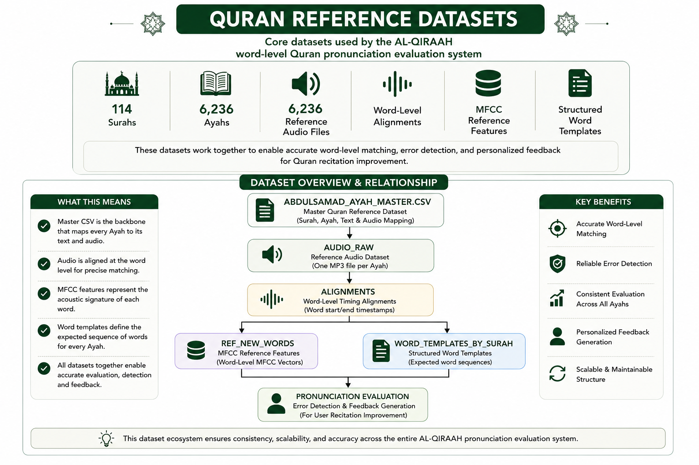
</p>

<p align="center">
  <i>Relationship Between Core AL-QIRAAH Datasets</i>
</p>

---

## AUDIO_RAW

The AUDIO_RAW dataset contains the original Quran recitation recordings used as the primary source for generating all downstream datasets.

It serves as the foundation for:

- Alignment generation
- Word segmentation
- MFCC feature extraction
- Reference dataset creation

<p align="center">
  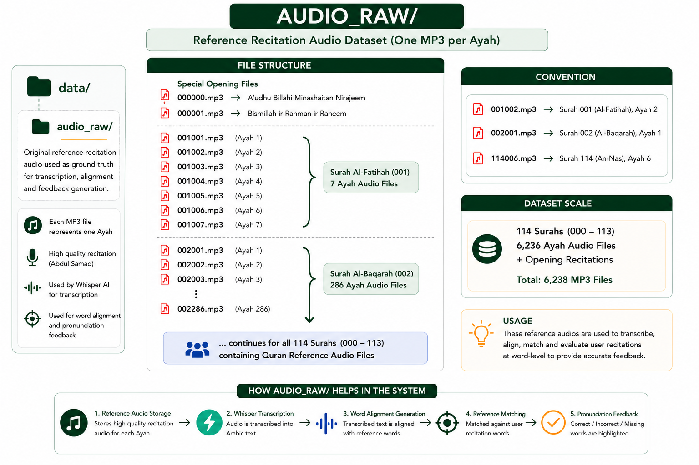
</p>

<p align="center">
  <i>AUDIO_RAW Dataset Structure and Processing Pipeline</i>
</p>

---

## ALIGNMENTS

The ALIGNMENTS dataset stores word-level timing metadata extracted from reference recitations.

These alignment files enable precise mapping between audio segments and Quran words.

Primary uses:

- Word segmentation
- Timing analysis
- Reference matching
- Pronunciation evaluation

<p align="center">
  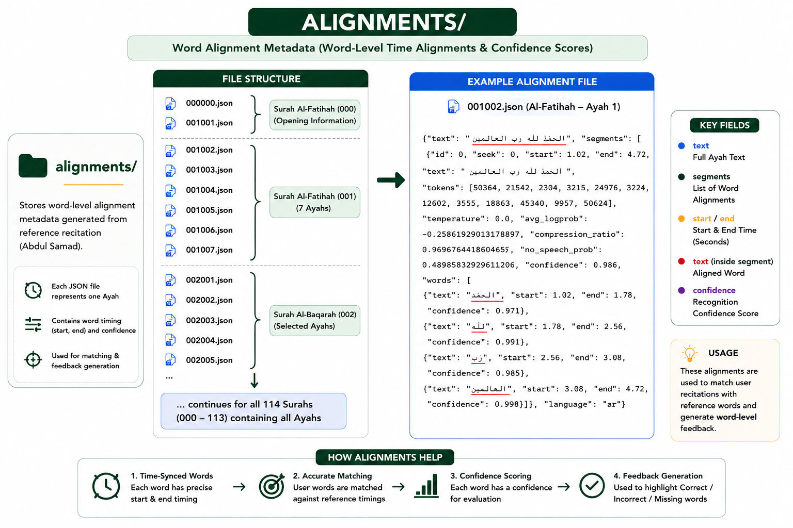
</p>

<p align="center">
  <i>ALIGNMENTS Dataset Structure and Usage</i>
</p>

---

## REF_NEW_WORDS

REF_NEW_WORDS contains reference MFCC feature vectors generated from Sheikh Abdul Samad's recitations.

These features are used as pronunciation templates during recitation evaluation.

Primary uses:

- Pronunciation matching
- Similarity analysis
- Word-level evaluation
- Feedback generation

<p align="center">
  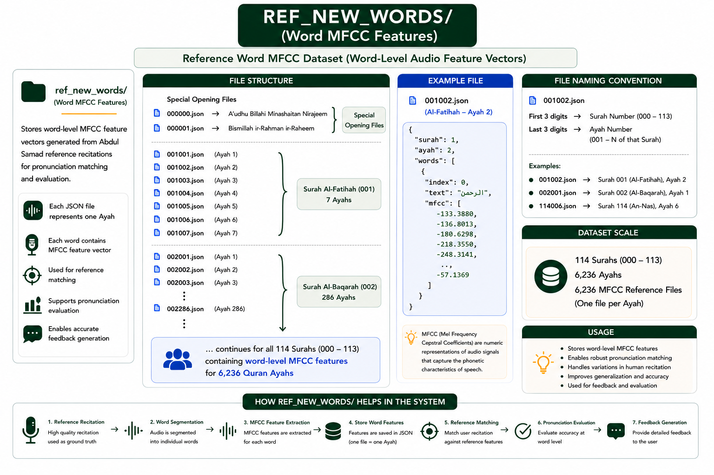
</p>

<p align="center">
  <i>REF_NEW_WORDS Dataset Structure and MFCC Feature Storage</i>
</p>

---

## WORD_TEMPLATES_BY_SURAH

WORD_TEMPLATES_BY_SURAH stores structured Quran word templates for every Ayah.

Each file contains the expected word sequence used for recitation matching and validation.

Primary uses:

- Word matching
- Missing word detection
- Ayah structure verification
- Feedback generation

<p align="center">
  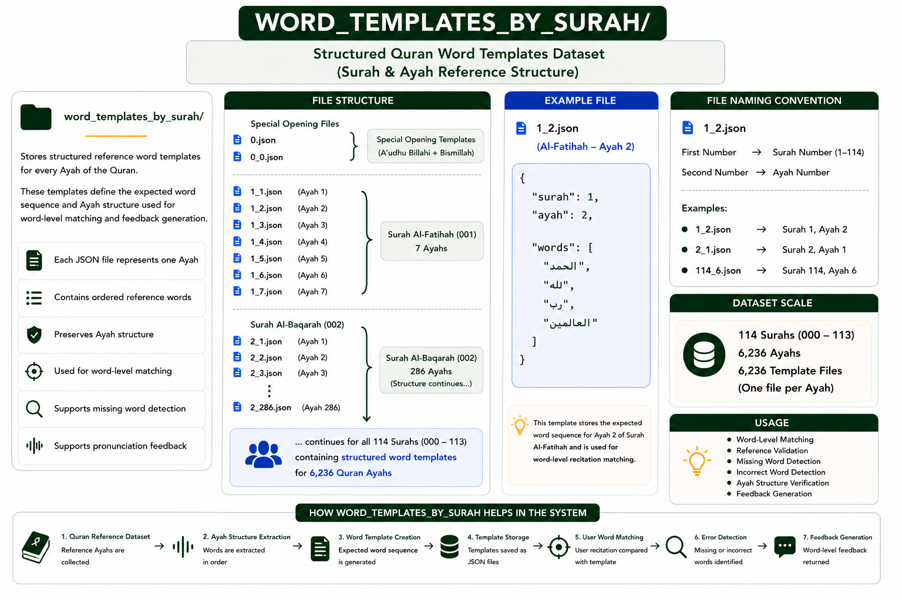
</p>

<p align="center">
  <i>WORD_TEMPLATES_BY_SURAH Dataset Structure and Usage</i>
</p>

---

## ABDULSAMAD_AYAH_MASTER

ABDULSAMAD_AYAH_MASTER serves as the master Quran reference dataset that connects Surahs, Ayahs, Quran text, and reference audio metadata.

This dataset acts as the backbone of the AL-QIRAAH system.

Primary uses:

- Quran metadata management
- Dataset generation
- Reference lookup
- Audio mapping

<p align="center">
  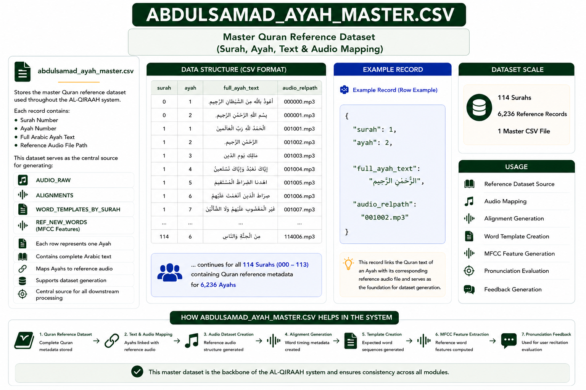
</p>

<p align="center">
  <i>ABDULSAMAD_AYAH_MASTER Dataset Structure and System Role</i>
</p>

---

## Dataset Summary

| Dataset | Purpose |
|----------|----------|
| AUDIO_RAW | Reference Quran recitation audio |
| ALIGNMENTS | Word-level timing metadata |
| REF_NEW_WORDS | MFCC pronunciation features |
| WORD_TEMPLATES_BY_SURAH | Expected Quran word sequences |
| ABDULSAMAD_AYAH_MASTER | Master Quran reference metadata |

---

Together, these datasets enable AL-QIRAAH to perform detailed Quran recitation evaluation, word-level pronunciation analysis, and intelligent feedback generation.

---
# User Interface

AL-QIRAAH provides a clean and user-friendly web interface designed specifically for Quran recitation evaluation. The application guides users through Surah selection, recitation, pronunciation analysis, and detailed word-level feedback.

The interface supports both Dark Mode and Light Mode themes, allowing users to choose their preferred reading environment.

---

## Landing Page

The landing page introduces the AL-QIRAAH platform and highlights its core capabilities, including AI-powered recitation analysis, word-level feedback, Arabic text processing, and Quran reference matching.

<p align="center">
  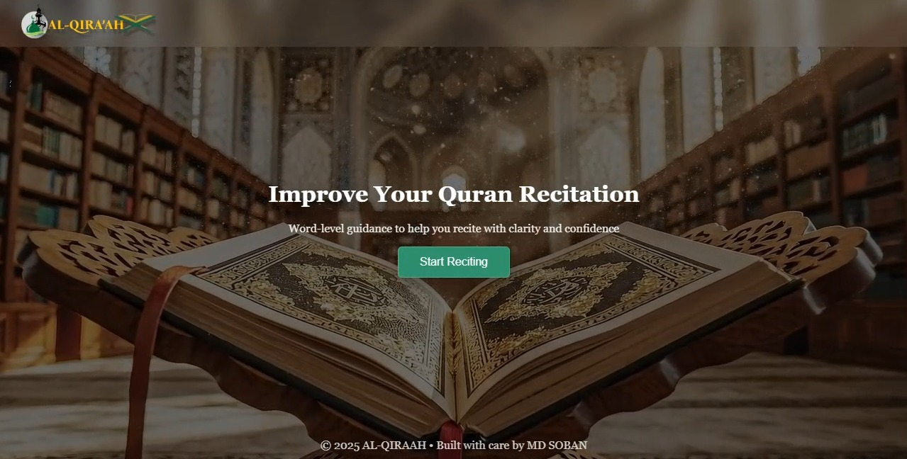
</p>

---

## Surah Selection Interface

Users can browse available Surahs and choose a chapter for recitation practice. The interface is designed for simplicity and quick navigation.

### Dark & Light Theme Support

<p align="center">
  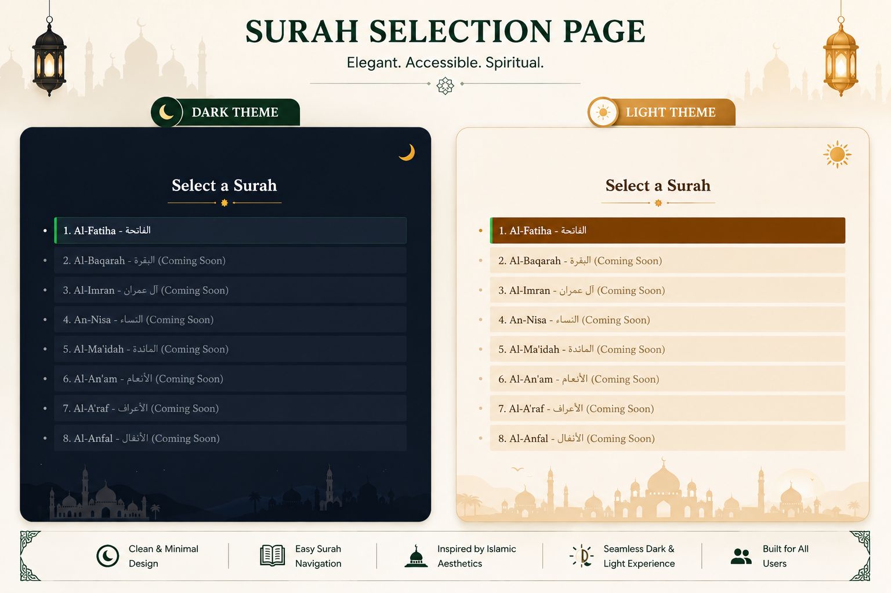
</p>

Key Features:

- Surah browsing and selection
- Arabic and English Surah names
- Theme switching support
- Responsive interface design
- Expansion-ready Surah structure

---

## Recitation Interface

After selecting a Surah and Ayah, users can begin recitation directly through the browser using their microphone.

### Dark & Light Theme Support

<p align="center">
  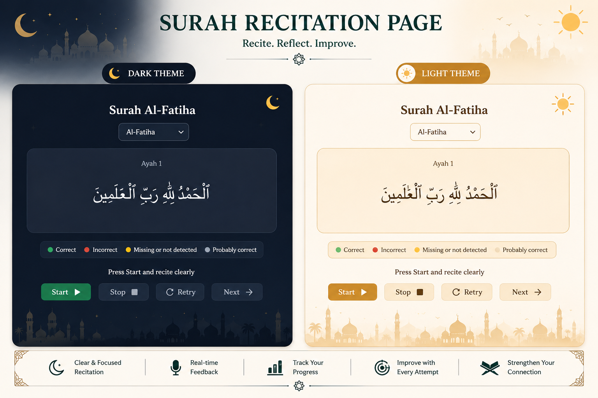
</p>

Key Features:

- Surah and Ayah navigation
- Real-time audio recording
- Arabic text display
- Start, Stop, Retry, and Next controls
- Integrated pronunciation evaluation workflow

---

## Word-Level Feedback Interface

After recitation analysis, AL-QIRAAH displays detailed color-coded feedback for each word.

### Dark & Light Theme Support

<p align="center">
  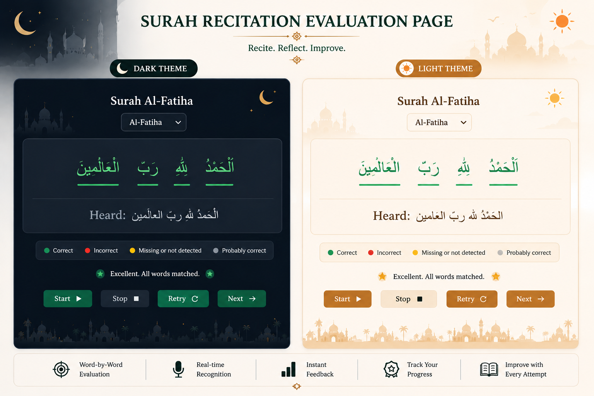
</p>

Feedback Categories:

| Color | Meaning |
|---------|---------|
| 🟢 Green | Correctly recited |
| 🟡 Yellow | Probably correct / Partial match |
| 🔴 Red | Incorrectly recited |
| ⚪ White | Missing or not detected |

The feedback interface enables users to immediately identify pronunciation issues and focus on specific words requiring improvement.

---

## User Experience Highlights

- Clean Quran-focused interface
- Dark and Light themes
- Word-level pronunciation visualization
- Real-time evaluation workflow
- Arabic text rendering support
- Beginner-friendly design
- Expansion-ready architecture for future Surahs and Ayahs

---
# Results & Evaluation

The following examples demonstrate AL-QIRAAH's ability to evaluate Quran recitations at the word level and provide detailed pronunciation feedback.

Each result is generated automatically after speech recognition, Arabic normalization, word matching, and pronunciation analysis.

---

## Example 1 — Perfect Recitation

All words were correctly recognized and matched with the reference Quran dataset.

<p align="center">
  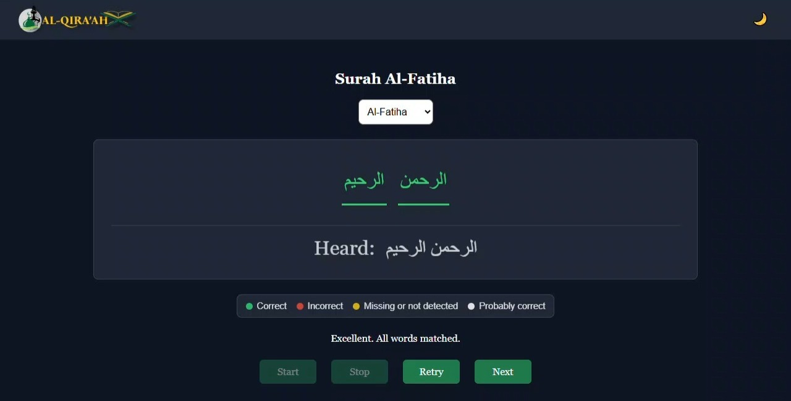
</p>

### Outcome

- All words detected successfully
- Accurate pronunciation match
- No missing words
- No incorrect words
- Complete Ayah validation

---

## Example 2 — Mostly Correct Recitation

Most words were correctly recognized, while some words were classified as probable matches due to pronunciation variations.

<p align="center">
  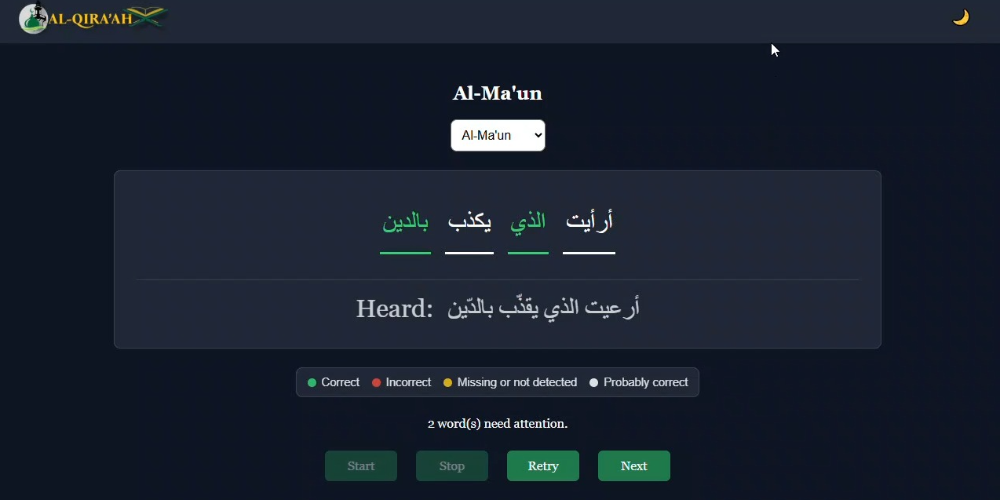
</p>

### Outcome

- Majority of words matched
- Minor pronunciation deviations detected
- Probable matches highlighted
- Useful for self-correction and practice

---

## Example 3 — Mixed Evaluation Result

The recitation contains a combination of correct, probable, and incorrect words.

<p align="center">
  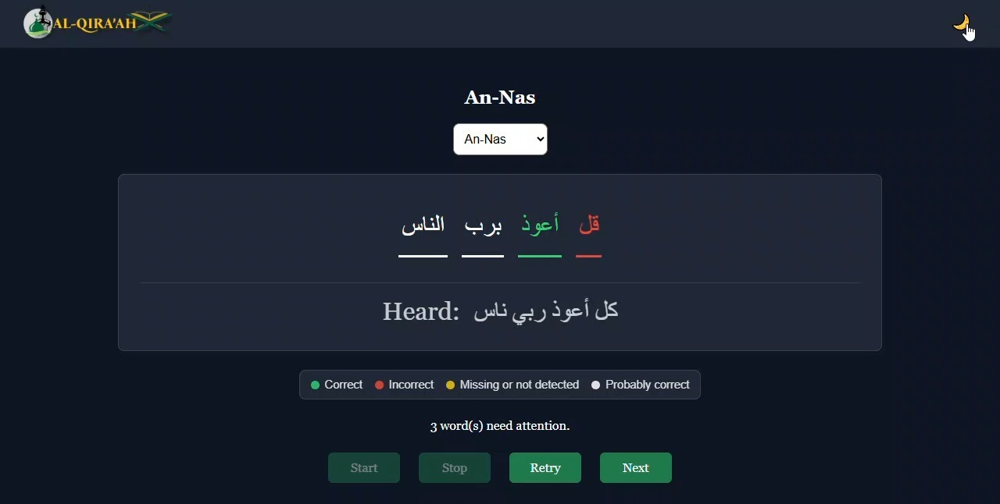
</p>

### Outcome

- Correct words identified
- Incorrect words highlighted
- Partial matches detected
- Detailed feedback provided at the word level

---

## Example 4 — Pronunciation Errors Detected

The system successfully identifies multiple pronunciation mistakes and highlights words requiring attention.

<p align="center">
  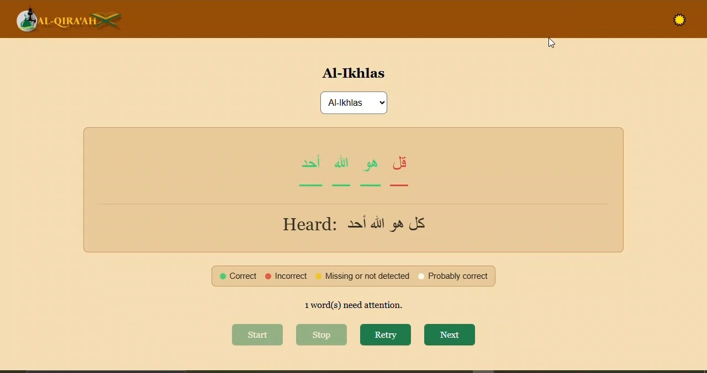
</p>

### Outcome

- Incorrect words detected
- Pronunciation mismatches identified
- Missing or weak matches highlighted
- Clear guidance for improvement

---

## Evaluation Categories

| Status | Meaning |
|----------|----------|
| 🟢 Correct | Word accurately matched with reference |
| 🟡 Probable Match | Similar pronunciation detected |
| 🔴 Incorrect | Pronunciation mismatch detected |
| ⚪ Missing / Undetected | Word was not recognized confidently |

---

## What These Results Demonstrate

- Real-time Quran recitation evaluation
- Word-level pronunciation analysis
- Reference-based validation
- Detection of pronunciation deviations
- Identification of missing words
- Color-coded visual feedback
- Practical recitation improvement assistance

The examples above demonstrate how AL-QIRAAH transforms a user's recitation into structured pronunciation feedback that can be used for continuous learning and improvement.

---

# Project Structure

AL-QIRAAH follows a modular architecture that separates backend services, frontend interfaces, and documentation assets. This organization makes the project easier to maintain, extend, and deploy.

## Repository Layout

```text
AL-QIRAAH/
│
├── backend/
│   ├── main.py
│   ├── arabic_normalize.py
│   ├── requirements.txt
│   ├── uploads/
│   ├── temp_audio/
│   ├── data_logs/
│   └── ref_new_words/
│
├── frontend/
│   ├── index.html
│   ├── surah.html
│   ├── recite.html
│   └── assets/
│       ├── css/
│       ├── js/
│       └── images/
│
├── assets/
│   ├── banner/
│   ├── logo/
│   ├── gif/
│   ├── architecture/
│   ├── datasets/
│   ├── ui/
│   └── results/
│
├── .gitignore
│
└── README.md
```

## Backend

The backend handles speech processing, pronunciation evaluation, Arabic text normalization, and communication with the frontend.

| File / Folder | Purpose |
|--------------|----------|
| `main.py` | FastAPI backend entry point |
| `arabic_normalize.py` | Arabic text cleaning and normalization |
| `requirements.txt` | Python dependencies |
| `uploads/` | User-recited audio files |
| `temp_audio/` | Temporary audio processing files |
| `data_logs/` | Session logs and evaluation records |
| `ref_new_words/` | Reference MFCC feature datasets |

---

## Frontend

The frontend provides the complete user interaction workflow for Quran recitation evaluation.

| File | Purpose |
|--------|----------|
| `index.html` | Landing page |
| `surah.html` | Surah selection interface |
| `recite.html` | Recitation and evaluation interface |
| `assets/css/` | Styling and theme support |
| `assets/js/` | Frontend logic and interaction handling |
| `assets/images/` | Static images used by the application |

---

## Documentation Assets

All images, diagrams, screenshots, and visual resources used throughout the README are organized under the `assets/` directory.

---

> The repository structure is intentionally modular to support future expansion toward complete Quran coverage, additional datasets, and enhanced pronunciation evaluation techniques.

# Installation & Setup

Follow the steps below to run AL-QIRAAH locally.

## 1. Clone the Repository

```bash
git clone https://github.com/<your-username>/AL-QIRAAH.git
cd AL-QIRAAH
```

## 2. Create a Virtual Environment

```bash
python -m venv .venv
```

### Activate Environment

**Windows**

```bash
.venv\Scripts\activate
```

**Linux / macOS**

```bash
source .venv/bin/activate
```

## 3. Install Dependencies

```bash
pip install --upgrade pip
pip install -r backend/requirements.txt
```

## 4. Start the Backend Server

Navigate to the backend directory:

```bash
cd backend
```

Start the FastAPI server:

```bash
uvicorn main:app --reload
```

Backend API:

```text
http://127.0.0.1:8000
```

---

## 5. Start the Frontend Server

Open a new terminal and navigate to the frontend directory:

```bash
cd frontend
```

Run:

```bash
python -m http.server 5500
```

Frontend URL:

```text
http://localhost:5500
```

---

## 6. Using the Application

1. Open:

```text
http://localhost:5500
```

2. Select a Surah.
3. Select an Ayah.
4. Allow microphone access.
5. Click **Start** to begin recording.
6. Recite the selected Ayah.
7. Wait for analysis to complete.
8. Review the generated word-level feedback.
9. Retry or continue to the next Ayah.

---

## Requirements

- Python 3.10+
- FastAPI
- OpenAI Whisper
- NumPy
- Librosa
- Modern Web Browser
- Microphone Access

---

## Notes

- The backend must be running before starting recitation analysis.
- Browser microphone permissions must be enabled.
- Audio quality directly affects recognition accuracy.
- Version 1.0 currently supports 11 Surahs containing 55 Ayahs.
- The system architecture is expandable and supports integration of additional Surahs, Ayahs, and reference datasets in future releases.

## Actual Workflow After Setup

Terminal 1:
- cd backend
- uvicorn main:app --reload

Terminal 2:
- cd frontend
- python -m http.server 5500

Browser:
http://localhost:5500

---
# Technologies Used

| Category           | Technologies          |
| ------------------ | --------------------- |
| Backend            | Python, FastAPI       |
| Frontend           | HTML, CSS, JavaScript |
| Speech Recognition | OpenAI Whisper        |
| Audio Processing   | Librosa, NumPy        |
| Data Storage       | JSON                  |
| Version Control    | Git, GitHub           |

---

### AI Processing Pipeline

```text
User Audio
    ↓
Whisper ASR
    ↓
Arabic Text Normalization
    ↓
Reference Dataset Matching
    ↓
MFCC Pronunciation Analysis
    ↓
Word-Level Feedback
```

---
# Current Prototype Scope & Expansion

AL-QIRAAH Version 1.0 is released as a prototype implementation and currently includes:

* 11 Supported Surahs
* 55 Quran Ayahs
* Custom Reference Datasets
* Complete Pronunciation Evaluation Pipeline

The system architecture, dataset structure, and evaluation pipeline were designed to support full Quran coverage.

## Expanding to Additional Surahs

To keep the GitHub repository lightweight and within storage limits, only a subset of Surahs is included in this release.

Additional Surah reference files can be obtained from the following Google Drive folder:

https://drive.google.com/drive/folders/1u0ewjchB1JlW132hN_DhzUcSzeS7iuHS?usp=drive_link

The provided reference JSON files can be integrated into the existing project structure to extend support beyond the 11 prototype Surahs.

The current implementation was intentionally limited to a smaller set of Surahs to demonstrate the complete AL-QIRAAH workflow while maintaining a manageable repository size.

## Dataset Availability

The complete development datasets, audio resources, alignment files, and research assets are not included in the public repository due to storage constraints.

For academic collaboration, project discussion, or dataset-related inquiries, feel free to connect through GitHub or LinkedIn.

---
# Future Scope

The current release of AL-QIRAAH demonstrates a complete end-to-end Quran recitation evaluation pipeline. Future versions aim to expand the platform's capabilities and Quran coverage.

### Planned Enhancements

* Support for all 114 Quran Surahs
* Complete Quran coverage (6,236 Ayahs)
* Enhanced pronunciation evaluation algorithms
* Improved Arabic speech recognition accuracy
* Real-time pronunciation correction
* Mobile application deployment
* User progress tracking and analytics
* Personalized recitation improvement recommendations
* Multi-reciter reference datasets
* Cloud-based deployment and scalability

### Long-Term Vision

The long-term goal of AL-QIRAAH is to evolve into a comprehensive AI-assisted Quran learning platform that helps users improve recitation accuracy through intelligent pronunciation analysis, structured feedback, and continuous learning support.

---
# Developer

AL-QIRAAH was independently designed and developed by:

### Mohammed Soban Shaikh

Areas of contribution:

* System Architecture Design
* Quran Reference Dataset Development
* Audio Processing Pipeline
* Arabic Text Normalization
* Word-Level Pronunciation Evaluation
* FastAPI Backend Development
* Frontend Development
* Documentation & Visualization

---

### Connect

* GitHub: *https://github.com/Md-Soban01*
* LinkedIn: *https://www.linkedin.com/in/shaikh-mohammed-soban-a53a092a8*

---
# License

This project is licensed under the MIT License.
See the LICENSE file for full details.

Copyright (c) 2026 Soban Shaikh


